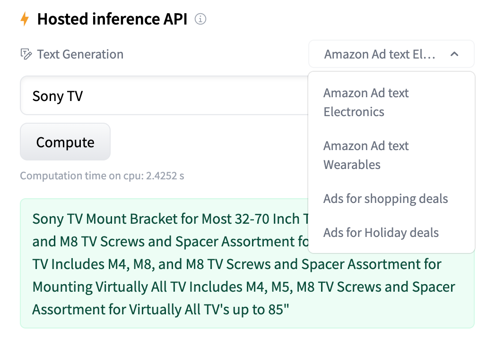

### Generating Ad text for Amazon shopping 

### Contents:
- [Problem Statement](#Problem-Statement)
- [Summary](#Summary)
- [Data Dictionary](#Data-Dictionary)
- [Methodology](#Methodology)
- [Findings and Observations](#Findings-and-Observations)
- [Live Demo](#Live-Demo)
- [How did we do - Inference](#Inference)
- [Conclusion](#Conclusion)
- [Next Steps](#Next-Steps)
- [References](#References)

#### Problem Statement

Amazon’s 6 million Sellers want to generate creative and fresh ads quickly and efficiently to promote their products on the Amazon web site. Current methods require much manual creation of the advertisement text and it is cumbersome for large Sellers who have many thousands of listed products. Fast moving items like consumer electronics are updated frequently and the ads need to be updated equally quickly. 

This is a large business opportunity and a few startups have begun using Natural Language Generation (NLG) technology to auto-generate text including Ads. The model can be easily fine-tuned for Ads for Google, Facebook, Bing and other e-commerce platforms, as well as many sentence completion applications like Quora Question Answer, personalised review generator, email subject lines and other marketing content. These GPT models also do a decent job in writing code! 

#### Summary
- Given that State of the Art models like OpenAI's GPT3 and EleutherAI's GPT-NEOs are trained on billions of parameters and cost upwards of $10M to train, how good can our RNN LSTM model really be? 
- How much data is sufficient and what e-commerce verticals work best? 
- How does our model compare with these Large Language models?
- Can we use our dataset to fine-tune these pre-trained models? 
- How well does our fine-tuned model perform? 
- What metrics can be used to evaluate the model?
- Can we open-source publish our model for others to fine-tune themselves?

#### Data Dictionary

<https://www.kaggle.com/datasets/sachsene/amazons-advertisements> from <https://github.com/paschok/Diploma>

#### Input Data
The dataset size is 252 MB and comprises of 2.7 million ad texts (each is one row in the csv) in 445 files across 40 categories like electronics, wearables, automotive, appliances, fashion, tools, accessories etc. 

Decided to use only 2 domains (electronics and wearables) since I could only use about 10-15K rows of training data without running into resource constraints. 

* [`amazon_tv_wearable_12k_holidays.csv`](../data/amazon_tv_wearable_12k_holidays.csv): Ad text data from amazon.com shopping

**Samples of ad text:** 

Sony SWR50 SmartWatch 3 Transflective Display Watch [Black]
Sony SmartWatch US version 1 Android Bluetooth USB Retail Box
Sony DVPSR510H DVD Player, with HDMI port (Upscaling)
Sony UBP-X700 4K Ultra HD Blu-Ray Player
Apple Watch Series 3 (GPS), 42mm Space Gray Aluminum Case with Black Sport Band - MQL12LL/A (Renewed)
Apple Watch Series 4 (GPS + Cellular, 40mm) - Gold Aluminium Case with Pink Sand Sport Band (Renewed)
Samsung Gear S2 Smartwatch - Dark Gray
Samsung HMD Odyssey+ Windows Mixed Reality Headset with 2 Wireless Controllers 3.5" Black (XE800ZBA-HC1US)
Samsung Galaxy Watch (42mm) Smartwatch (Bluetooth) Android/iOS Compatible -SM-R810 (Rose Gold)
Samsung Galaxy Fit Black (Bluetooth), SM-R370NZKAXAR – US Version with Warranty
Dell Mobile Projector M318WL 500 ANSI lumens WXGA (1280 x 800) 16:10
Full Motion Tilt, Pan, Swivel Desktop Mount for 32" Samsung, LG, Dell, ViewSonic, HP LED TV/Monitor
Casio WSD-F10 Smart Outdoor Watch
AmazonBasics TV Trolley for 24-43" TVs with Swivel Feature
NVIDIA SHIELD TV Gaming Edition | 4K HDR Streaming Media Player with GeForce NOW

#### Output Data files

Generated when running the notebook. 

**Model evaluation metrics**

* [`lstm_results_df.csv`](./data/lstm_results_df_holidays.csv): Evaluation metrics for both the models. 

* `lstm_model_13krows_batch4k.h5`: My trained RNN LSTM model 
* `lstm_model_emb_13k_batch4k.h5`: My trained model with embedding layer

* `pytorch_model.bin`: Model fine-tuned on the amazon ads dataset on top of the pre-trained EleutherAI/gpt-neo-125M model.   
Published this to HuggingFace https://huggingface.co/nirajsaran/AdTextGenerator for interactive online ad text generation or use by others for further downstream fine-tuning. 

* `config.json`: Config file for the above 

#### Image files
For presentation purposes

#### Methodology
**RNN LSTM with Embedding layer:** 

1. Why LSTM? LSTM works well for modeling sequential data as they generalize across sequences
2. Tensorflow Keras model
    a. Amazon ads dataset (2M rows, one column, 40 categories, 250MB). Not much data cleanup or EDA!
    While doing the EDA, thought about dropping certain tokens or documents - those that contain model numbers or if the ad text was less than 5 tokens long. However, model numbers and product names are relevant and I decided to keep them. 

    b. Keras Embedding layer to vectorize each word along with semantic information
    Was considering pre-trained Word2Vec or GloVe but they are not great for proper nouns and product names, so decided to use the Embedding layer instead. 

    c. Tokenize, map to IDs,  subclassed Keras Sequence object creates sequences for input and next words 
    **Example of tokens, ids, sequences and next word:**   
Tokens and their numeric ids
['ZAGG', 'InvisibleShield', 'Luxe', 'Screen', 'Protector', 'for', 'Apple', 'Watch', 'Series', '2'] 
[3393, 963, 9601, 18828, 12556, 10430, 5129, 544, 9532, 9217] 

    Sequence: 3 input words and target 
Sequence[0] : Zagg Invisible Luxe Screen 
Sequence[1] : Screen Protector for Apple 
[ [ 3393, 963, 9601, 18828], 
[18828, 12556, 10430, 5129]]   

    d. Self-supervised learning
    e. TextDataGenerator - Python generator outputs batches of data (X and y) 

    TextDataGenerator is a Python generator that outputs batches of data (sequences and corresponding next words). Since the vocabulary size is over 25k, it's impossible to fit all data to the memory and that's why batch generator is extremely useful.

    f. Predict: vector of size = vocabulary; probability assigned to each word in corpus
3. Google Colab with .py and GPU: 8x performance improvement
4. Comparison with OpenAI's GPT-2 and EleutherAI's gpt-neo-1.3B - zero shot
5. Fine-tuned pre-trained model EleutherAI's gpt-neo-125M  with my ads data using Python package aitextgen 
6. Determination of most relevant metrics
        categorical_accuracy and top_k_categorical_accuracy against baseline
7. Published to HuggingFace - 100+ downloads already!

#### Findings and Observations

- Deep Learning is hard
- Not just CPU, ran out of memory and disk
- Could not use 99.5% of the total data
- For 2M docs, 5 years to train on local machine and 7 months on G Colab! 
- At 25k documents - OOM
- 13k rows, chars: 4,520,879, total tokens: 321,785, distinct tokens: 24101, num sequences: 96544, model trainable params: 15,514,789
- 30 min training time on Google Colab with GPU, 19 mins with Embedding layer. 1 hour 40 mins fine-tuning time on Colab with EleutherAI's gpt-neo-125M
- Tuned multiple model params - batch_size, num input nodes, dimension of vectors in embedding, sequence length 
- Fun Fact: Output shape is size of vocabulary (24k) - very different from the 2 in a binary classification or 10 in the MNIST image 0-9 digit classification! sys

#### Metrics

- Surprisingly, performed quite well! 
- Baseline is defined as no training, just one epoch
- Metrics are much better than baseline

- Top K categorical accuracy of 0.95 is really good, though hard to tell if there is overfitting since there is no comparable validation data metrics (Keras doesn’t easily support validation data with Sequences)

- Text generated is not too bad

## In addition to our own model, we had two more goals, 
1. How do we compare against the pre-trained models like GPT-2 and GPT-NEO 
2. Can we fine tune these pre-trained models with our dataset to get better results

We will look below at the output generated by GPT-2 and GPT-NEO and ways to control their output to increase the quality of the generated Ads. 

**Control output of pre-trained models:**  
Parameters like Temperature, Top K, Top-P control the output generated by the pre-trained models.  

**Extending pre-trained models:**  

There are 2 ways to customize these large pre-trained models. They are trained on a large amount of data so they don’t need any additional training for the most part - you can just feed it some text and it generates reasonably good output - this is zero-shot learning. 

As you can see in the graph, by giving it one example prompt (one-shot), increases accuracy from 10% to 40-50% and more examples (few-shot learning) increases the accuracy even more - in the range of 60-70%.  

Fine tuning - is training the pre-trained model with your own dataset.

**Fine tuning:**
For fine tuning used Aitextgen which is a Python tool for text-based AI training and generation using [OpenAI's](https://openai.com/) [GPT-2](https://openai.com/blog/better-language-models/) and [EleutherAI's](https://www.eleuther.ai/) [GPT Neo/GPT-3](https://github.com/EleutherAI/gpt-neo) architecture.

aitextgen is a Python package that leverages [PyTorch](https://pytorch.org/), [Hugging Face Transformers](https://github.com/huggingface/transformers) and [pytorch-lightning](https://github.com/PyTorchLightning/pytorch-lightning) with specific optimizations for text generation using GPT-2

While training/finetuning a model, two files will be created: the pytorch\_model.bin which contains the weights for the model, and a config.json illustrating the architecture for the model. Both of these files are needed to reload the model.

These files and a couple more are uploaded to HuggingFace to publish our fine tuned model. 

**Comparison with Causal Large Language Models:**  

My model is trained on 2MB of data. I had very low expectations

- Market leader: OpenAI’s GPT-3 trained on 450 of data! Took $5M and 6 months to train with 100 GPU backends
- Reduced to 2 categories Electronics and Wearables (stopped using clothes, shoes etc). Quality of ad text generation improves significantly (not surprisingly)
- Both the gpt-2 and gpt-neo-1.3B pre-trained models don’t do well with zero shot in generating ad text (not surprising)
- Customization helps: Greedy/sampling, temperature, top-k, top-p, repetition_penalty
- Fine tuning: can only use gpt-neo-125M, others (GPT2-355M, 774M, 1558M and GPT-NEO-355M and 1.3B) are crashing the Colab session or give OOM
- My fine-tuned model does really well, though some hallucinations exist

#### How did we do - Inference

Fine-tuned model generates ads which are not quite distinguishable from humans 

#### Live Demo

My fine tuned model fine tuned on the EleutherAI gpt-neo-125M is published on HuggingFace! 
Its live and a compelling demo! 

https://huggingface.co/nirajsaran/AdTextGenerator

Screenshots: 

Customization of the model card with examples of input prompts.

**Steps to publish to HuggingFace “GitHub of Machine Learning”:**

- Download model 
    - https://huggingface.co/EleutherAI
    - https://huggingface.co/nirajsaran/AdTextGenerator
- Fine tune 
Python wrapper aitextgen for fine-tuning using your task specific dataset
- Upload 
    - huggingface.co/new
- Customize
    - model params: temperature, Top K, num return sequences
    - model card: title text, examples input prompt
- Let others use or fine-tune it for downstream apps!

#### Conclusion

- The RNN LSTM model built from scratch works reasonably well even with only 13k documents
- The Large Language Models like GPT-2 and GPT_NEO etc do really well on the text they're trained on, with zero-shot learning
- They are not suitable for my use case - generating text for Amazon advertisements
- They do have "few-shot learning", where you can provide prompts in a line or two. Learns from this minimal training data to generate similar output content. I have not found it generate ad text, especially for Amazon ads
- Fine-tuning these pre-trained models with supervised dataset specific to the desired task works best

#### Next Steps

- Ad text quality is really good with fine-tuned model. Good to deploy! 
- Expand to additional categories and also beyond Amazon Ads to Google, Facebook and LinkedIn ads
- Calculate Perplexity metrics
- Can improve performance by using TPU
    - Error during model.fit  on Google Colab with TPU:
        - Failed to connect to all addresses.. This is a known blocking issue with TPUs - they don't support PyFunction. Details https://github.com/tensorflow/tensorflow/issues/38762, #34346, #39099
- Known Issues: 
    - Don’t have validation data to check for overfit. Running into error when using validation_data during fit
        - InvalidArgumentError: Graph execution error: Specified a list with shape [4096,22555] from a tensor with shape [4096,5570]

#### References
https://towardsdatascience.com/text-generation-gpt-2-lstm-markov-chain-9ea371820e1e

https://github.com/klaudia-nazarko/nlg-text-generation/blob/main/lstm.ipynb

https://docs.aitextgen.io/

https://huggingface.co/docs/hub/model-repos#when-sharing-a-model-what-should-i-add-to-my-model-card

### Model architecture:

vocab_size = 24101
layer_size = 128
sequence_lenght = 4

model = Sequential()

`  `if embedding:

`    `model.add(Embedding(input\_dim = vocab\_size, output\_dim = layer\_size, input\_length = sequence\_length )) 

`    `model.add(LSTM(layer\_size))    

`  `else:

`    `model.add(LSTM(layer\_size, input\_shape=(sequence\_length, vocab\_size)))

`  `model.add(Dropout(0.3))

`  `model.add(Dense(vocab\_size, activation='softmax'))

